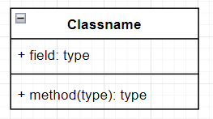
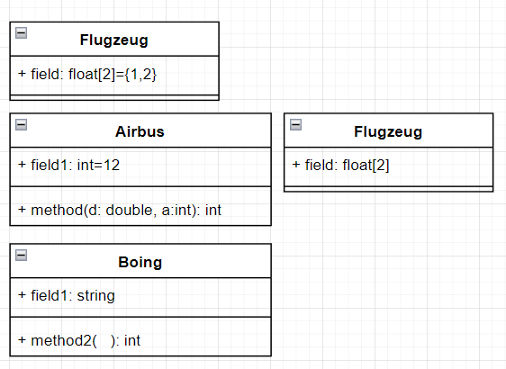

# Technische Dokumentation

in diesem Teil Dokumentieren wir die einzelnen Funktion des **ClassCreators** näher beschrieben.

## Form Drawio

Es wird die folgende form in Drawio verwendet **UML\Class**.

### Syntax Atribute und Methoden
Die **Atribute** und die **Methoden** haben die folgende Syntax

**Abweichungen von diesem **Syntax** führen zu einer Fehlermeldung**
## Veerbung
In dem folgendem Diagramm wird die Veerbung bei Klassen dargestellt.

Der Pfeil mit der leeren Spitze ist für die Veerbung zwei Klassen vorgesehen. Jeder andere Pfeil wird von dem Übersetzer ignoriert.
## Der Aufruf über die Konsole
Der folgende Befehl ruft das Programm **ClassCreator** über die Konsole auf

	ClassCreator.py [Name Drawio File] [Name Diagramm]
