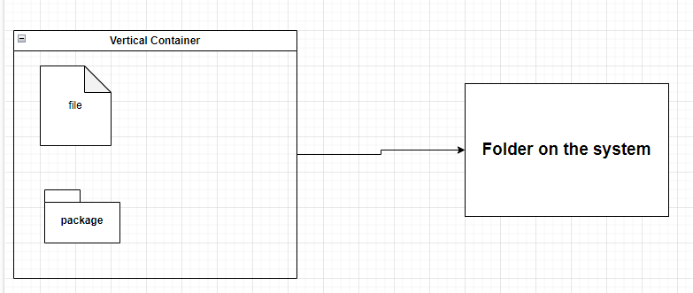
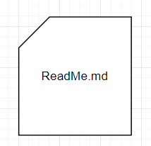
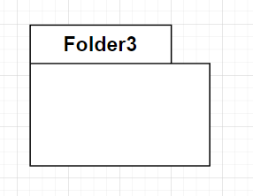

# FolderCreator

In diesem Teil wird eine einfache Anwendung der Implementierung von 
**LexDrawio** vorgestellt. 

Die Anwendung **FolderCreator** hat die folgende Aufgabe, sie generiert aus einem Diagram **Odner** und **Dateien** auf dem Computer.

*************************************************************

    

## Demonstration

Wir beginnen mit dem Folgenden Diagram. 

Dieses wurde mit **Drawio** erstellt  und unter **FolderDiagramm.drawio** abgespreichert.

Hier sind einige **Ordner** und eine **Datei** zu sehen. Die **balue Markierung**  ist das **Stammverzeichniss** in welchem die Odner/Datein später erzeugt werden. 

Der nächste Schritt ist das Öfnnen einer **Konsole**, dort geben wir den 
folgenden Befehl ein

    .\FolderCreator.py FolderDiagramm.drawio

Dieser generiert die Ordner/Datein in dem entsprechenden Verzeichniss. 
    
Der **Output** ist :

    
# Technische Details

Die folgenden **Formen** wurden in **Drawio** benutzt.

## Card

## UML2.5/Folder

************************************
    

## Konsolen aufruf

Das Skript **FolderCreator.py** kann über den folgeden Konsolenbfehl 
aufgerifen werden.

    .\FolderCreator.py    [Name des Drawio files]

