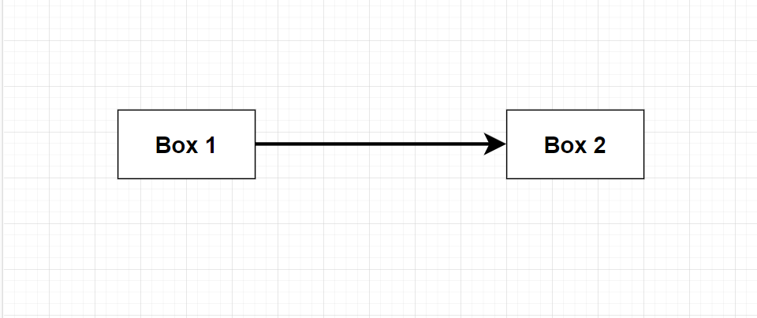
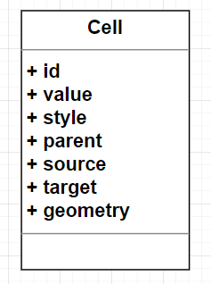
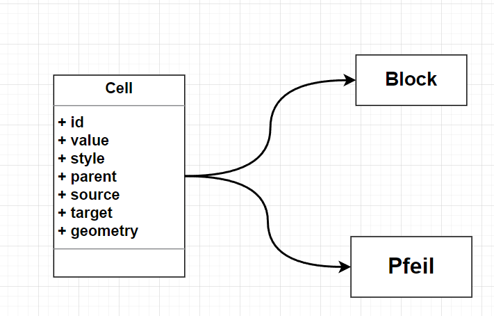
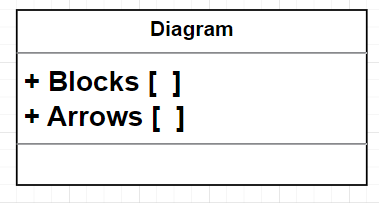

# Lexikalische Analyse der **Xml-Codierung** von **Drawio**

In diesem Teil analysieren wir die LexikalischeStrukur von einem 
**Drawio-Xml** näher.

## Analyse

Betrachten wir das folgende **Diagramm**.

In diesem haben wir zwei Blöcke und einen Pfeil. Das Speichern des Diagramms  ergibt den folgende **XML-Code**. 

    <mxfile host="Electron" modified="2024-03-28T14:14:37.600Z" agent="Mozilla/5.0 (Windows NT 10.0; Win64; x64) AppleWebKit/537.36 (KHTML, like Gecko) draw.io/21.6.1 Chrome/112.0.5615.204 Electron/24.6.1 Safari/537.36" etag="0gsPTP5QGst4goSF_jeZ" version="21.6.1" type="device">
    <diagram name="Seite-1" id="QgJ4ycloEwYY7uyVC8ky">
    <mxGraphModel dx="1418" dy="828" grid="1" gridSize="10" guides="1" tooltips="1" connect="1" arrows="1" fold="1" page="1" pageScale="1" pageWidth="827" pageHeight="1169" math="0" shadow="0">
      <root>
        <mxCell id="0" />
        <mxCell id="1" parent="0" />
        <mxCell id="zjhZrKwW_J0MbZv0IyZs-3" style="edgeStyle=orthogonalEdgeStyle;rounded=0;orthogonalLoop=1;jettySize=auto;html=1;entryX=0;entryY=0.5;entryDx=0;entryDy=0;endSize=10;targetPerimeterSpacing=0;strokeWidth=3;" edge="1" parent="1" source="zjhZrKwW_J0MbZv0IyZs-1" target="zjhZrKwW_J0MbZv0IyZs-2">
          <mxGeometry relative="1" as="geometry" />
        </mxCell>
        <mxCell id="zjhZrKwW_J0MbZv0IyZs-1" value="&lt;b&gt;&lt;font style=&quot;font-size: 20px;&quot;&gt;Box 1&lt;/font&gt;&lt;/b&gt;" style="rounded=0;whiteSpace=wrap;html=1;" vertex="1" parent="1">
          <mxGeometry x="100" y="180" width="120" height="60" as="geometry" />
        </mxCell>
        <mxCell id="zjhZrKwW_J0MbZv0IyZs-2" value="&lt;b&gt;&lt;font style=&quot;font-size: 20px;&quot;&gt;Box 2&lt;/font&gt;&lt;/b&gt;" style="rounded=0;whiteSpace=wrap;html=1;" vertex="1" parent="1">
          <mxGeometry x="440" y="180" width="120" height="60" as="geometry" />
        </mxCell>
      </root>
            </mxGraphModel>
        </diagram>
    </mxfile>

Dieser wirkt auf den ersten Blick, wenig übersichtlich.  Aber wird nur ein kleiner Teil betrachtet, nähmlich eine Zelle.

    <mxCell id="zjhZrKwW_J0MbZv0IyZs-2" value="..." 

    style="rounded=0;whiteSpace=wrap;html=1;" vertex="1" parent="1">

        <mxGeometry x="440" y="180" width="120" height="60" as="geometry" />

    </mxCell>

So lässt sich hier ein einfaches Modell, von den Objekten, in dem Diagramm erkennen.  Eine Celle entspricht dem folgenden **Objekt**: 

* Die **id** macht das Objekt im Diagramm einzigartig
* Der **value** gibt den **Text** in der Zelle an. Im obigen Diagramm ist es **Box 1**

* **style** beschreibt das Ausehen. Hier ist auch der Typ der **Zelle** enthalten.
* **source** und **target** gibt es nur bei **Pfeilen**. 
* **parent** Das ist die **id** der Zelle auf der diese liegt.
* **geometry** beinhaltet die **Position** und die **Abmessungen** der Zelle.

Mit diesem **Modell** können wir nun das ganze Diagramm Analysieren und einzelnen Zellen zerlegen. Aber , das ist nicht ausreichend, den für spätere anwendungen macht es Sinn zwischen **Blöcken** und **Pfeilen** zu unterscheiden. Daher Werden die einzelnen Zellen erneut in  **Blöcke** und **Pfeile** eingeteilt.

## Implementierung

Die Implementierung der Analyse des letzten Abschnittes erfolgt mit der
Sprache **Python** . Der Quellcode kan in dem Skript **[LexDrawio](LexDrawio.py)** eingesehen 
werden. Betrachten wir erneut das **Diagram** vom Anfang ergibt sich mit dem folgeden Skript eine Menge von **Objekten**. 

    
    from LexDrawio import *

    file_path = 'TestDiagram.drawio'  

    Dia=ParseDiagramsFromXmlFile(file_path)
    Blocks= Dia["Test1"].blocks
    Arrows=Dia["Test1"].arrows

    print("Blocks:")
    for block  in Blocks:

        block.PrintData()

    print("Arrows:")
    for arrow in Arrows:

        arrow.PrintData()

Die Funktion **ParseDiagramsFromXmlFile** übersetzt das **Xml** von oben in den folgenden Output.

**Output:**

        Blocks:
           id:                            P6SZsiiUyjcr6V_XTpoD-2
           parent:                1
           value:                   Box 1
           style:                     ['rounded=0', 'whiteSpace=wrap', 'html=1', '']
           source:                 None
           target:                  None
           geometry:          {'x': '100', 'y': '180', 'width': '120', 'height': '60', 'as': 'geometry'}
           
           ------------------------------------------------------
           
           id:                            P6SZsiiUyjcr6V_XTpoD-3
           parent:                1
           value:                   Box 2
           style:       ['rounded=0', 'whiteSpace=wrap', 'html=1', '']
           source:                 None
           target:                  None
           geometry:          {'x': '440', 'y': '180', 'width': '120', 'height': '60', 'as': 'geometry'}
           
           ------------------------------------------------------
          Arrows:     
           id:                            P6SZsiiUyjcr6V_XTpoD-1
           parent:                1
           value:                   None
           style: ['edgeStyle=orthogonalEdgeStyle', 'rounded=0'... ]
           source:                 P6SZsiiUyjcr6V_XTpoD-2
           target:                  P6SZsiiUyjcr6V_XTpoD-3
           geometry:          {'x': None, 'y': None, 'width': None, 'height': None, 'as': 'geometry'}
           
           ------------------------------------------------------

Die Einträge entspechen dem obigen Datenmodel von der **Cell** , auch wird zwischen **Blöcken** und **Pfeilen** unterschieden. 

Ein weiteres Modell muss noch berücksichtigt werden, den ein **Drawio Xml** kann mehere **Diagrame** beinhalten. In der Implementierung wird dies durch die folgende Klasse realisiert.

Die Code-Dokumentation für das Skript **File** befindet sich in dem Dokument [CodeDoc](CodeDoc.md)

## Ausblick

Einige Komplexe beispiele befinden sich in den beiden verzeichnissen.

* **[FolderCreator](FolderCreator/README.md)**
* **[CodeBlockGenerator](CodeBlockGenerator/README.md)**

