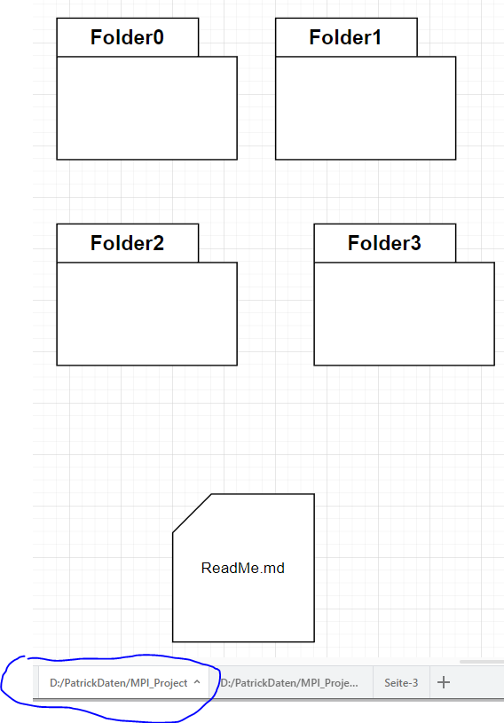
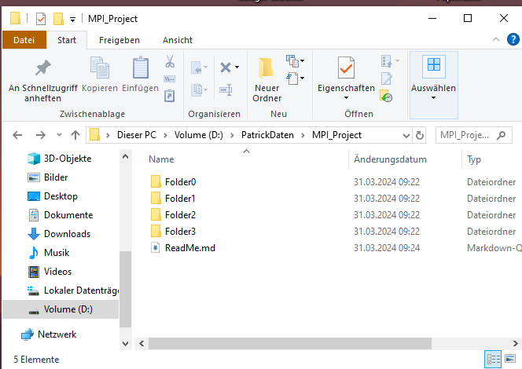

# UML zu Quellcode
**Author:** Patrick Dieu
## Abstract

In diesem Projekt geht es um die Übersetzung von **UML-Diagrammen** in 
ausführbaren Quellcode. Das heißt es wird aus
**Modellen**, die in UML vorliegen, automatisiert Quellcode geniert und dieser zu einem ausführbarem Programm compilliert.

Das Format der **UML** stammt aus der **App Drawio** die wir in diesem Projekt benutzen werden.
Die in Drawio in **Xml-Codierten** UML-Diagrame werden wir im verlauf dieses Projektes in Quellcode umwandeln und daraus ausführbare Programme machen.

   

# Inhaltsverzeichniss

1.  [Lexikalische Analyse der **Xml-Codierung** von **Drawio**](LexDrawio)

    

# Aktuelles
**Hier wird der aktuelle Stand und die neusten Errungenschaften Präsentiert.**
**************************
# FolderCreator
Wir beginnen mit dem Folgenden Diagram. 

Dieses wurde mit **Drawio** erstellt  und unter **FolderDiagramm.drawio** abgespreichert.

Hier sind einige **Ordner** und eine **Datei** zu sehen. Die **balue Markierung**  ist das **Stammverzeichniss** in welchem die Odner/Datein später erzeugt werden. 

Der nächste Schritt ist das Öfnnen einer **Konsole**, dort geben wir den 
folgenden Befehl ein

    .\FolderCreator.py FolderDiagramm.drawio

Dieser generiert die Ordner/Datein in dem entsprechenden Verzeichniss. 
    
Der **Output** ist :

  
Mehr information unter [**FolderCreator**](LexDrawio/FolderCreator)

## Literatur

* [1] **UML 2.5 Das Umfassende Handbuch, Rheinwerk Computer, Kecher Salvanos; Hoffman Elbern, 6. Auflage**