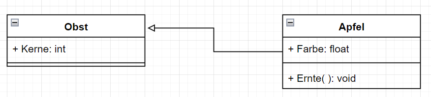

# UML zu Quellcode
**Author:** Patrick Dieu
## Abstract

In diesem Projekt geht es um die Übersetzung von **UML-Diagrammen** in 
ausführbaren Quellcode. Das heißt es wird aus
**Modellen**, die in UML vorliegen, automatisiert Quellcode geniert und dieser zu einem ausführbarem Programm compilliert.

Das Format der **UML** stammt aus der **App Drawio** die wir in diesem Projekt benutzen werden.
Die in Drawio in **Xml-Codierten** UML-Diagrame werden wir im verlauf dieses Projektes in Quellcode umwandeln und daraus ausführbare Programme machen.

   

# Inhaltsverzeichniss

1.  [Lexikalische Analyse der **Xml-Codierung** von **Drawio**](LexDrawio)
2.  [Übersetzen von Klassen-Diagrammen](ClassCreator)

    

# Aktuelles
**Hier wird der aktuelle Stand und die neusten Errungenschaften Präsentiert.**
**************************
# ClassCreator Quickstart

Zu beginn legen wir das folgende Klassen Diagramm in **Drawio** an.

Wichtig ist, das nur die folgenden **Formen** verwendet werden.
* UML/Class
* Pfeil mit breiten weissen Kopf

Der folgende Konsolen aufruf generiert dann den entsprechenden **Quellcode**

	ClassCreator.py ClassDiagramm.drawio Quick.cs

**Output:**

	namespace Quick{

	public abstract class Obst_UML   {

	public  int Kerne{ get; set; }

   
	}
              
	public abstract class Apfel_UML :Obst_UML  {

	public  float Farbe{ get; set; }

	public  abstract   void  Ernte ();
      
		}
              
	}

[**Generierter Code in Quick.cs**](ClassCreator/Doc/Quick.cs)

### Näheres in dem Ordner [ClassCreator](ClassCreator)

## Literatur

* [1] **UML 2.5 Das Umfassende Handbuch, Rheinwerk Computer, Kecher Salvanos; Hoffman Elbern, 6. Auflage**